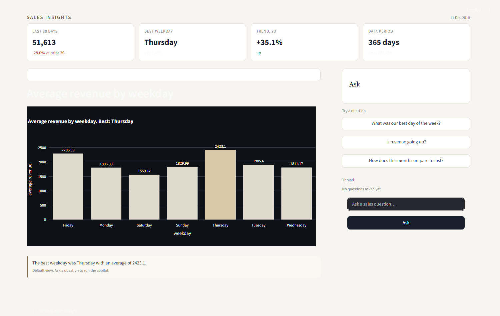

# AI Sales Insights Copilot

Ask your sales data a question. Get the numbers, the chart, and the story in plain words.

Built with pandas, Plotly, Streamlit, and an LLM. The LLM never computes. Pandas computes every number. The chart plots those exact numbers. The insight describes those numbers. All three always agree.

## How it works

Type a question like "what was our best day of the week?". The pipeline runs five steps:

1. `classify_question` names the question type: trend, best_day, comparison, or fallback.
2. `analyze` computes the answer with pandas.
3. `build_chart` plots the pandas numbers with Plotly.
4. `write_insight` asks the LLM to narrate the numbers in plain words.
5. Streamlit renders the chart, the numbers, and the insight together.

A weekly auto-insight path summarizes the last 4 weeks from pandas totals.

## Highlights

- Grounded answers. Every number comes from pandas, never from the model.
- One chart per answer, always matching the pandas result.
- 3 seeded question types plus a graceful fallback.
- Free LLM backend through OpenRouter: `openai/gpt-oss-20b:free`.
- Hard safety net: a slow or missing model degrades to a grounded fallback, never a crash.
- 22 automated tests plus a full end-to-end smoke test.

## Tech stack

Python 3.11, pandas, numpy, Plotly, Streamlit, LangChain, OpenRouter (gpt-oss-20b:free).

## Repo layout

```
app/            core pipeline: data, understand, analyze, charts, insights, pipeline
frontend/       streamlit_app.py (Executive Desk theme)
scripts/        generate_sales.py, smoke_test.py, verify_app.py
tests/          22 pytest tests
data/sales.csv  365 days of revenue, real Superstore-derived numbers
sketches/       3 UI themes; Executive Desk was chosen and built
docs/           GSD documentation set
assets/         architecture diagram
```

## Quick start

```bash
python -m venv venv
source venv/bin/activate          # Windows: venv\Scripts\activate
pip install -r requirements.txt
cp .env.example .env              # add your OPENROUTER_API_KEY
streamlit run frontend/streamlit_app.py
```

Open http://localhost:8501. Data is committed, no generation needed.

## The app



## Verify

```bash
python -m pytest                              # 22 unit tests, fast, offline
python scripts/smoke_test.py                  # full live pipeline test, minutes
```

## Documentation

- `docs/GETTING-STARTED.md`: setup step by step.
- `docs/ARCHITECTURE.md`: data flow and design rules.
- `docs/DEVELOPMENT.md`: build workflow and milestones.
- `docs/TESTING.md`: tests and manual checklist.
- `docs/CONFIGURATION.md`: environment keys and defaults.

## Project state

Levels 1 to 5 complete. See ROADMAP.md for the full ladder.